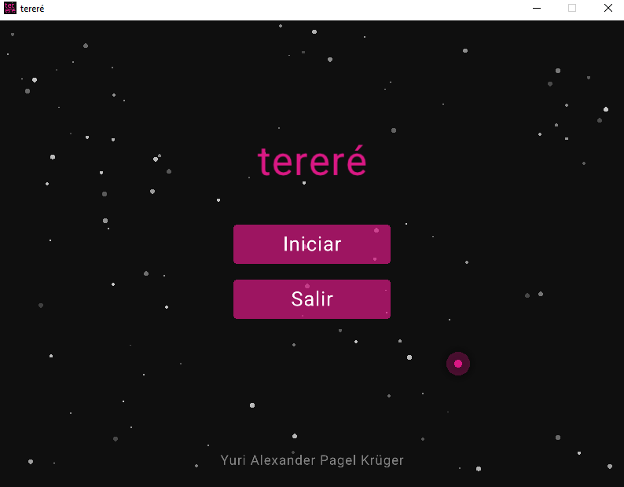
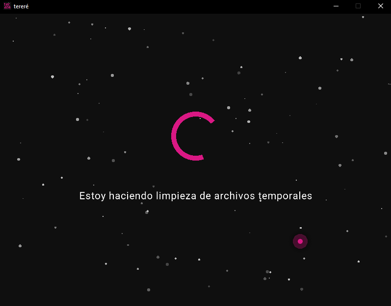

# tereré

**tereré** es una herramienta de limpieza y optimización para Windows escrita en C++. A diferencia de los optimizadores tradicionales que están sobrecargados de menús complejos, *tereré* fusiona el mantenimiento profundo del sistema con una interfaz gráfica (GUI) altamente estética, fluida y minimalista.

Con un solo clic, la aplicación se encarga de revitalizar el sistema operativo en segundo plano, mientras el usuario disfruta de una experiencia visual relajante.

## 📸 Capturas de pantalla

*Pantalla principal con efecto de partículas y detección de tema del sistema.*

*Vista de carga y progreso durante el mantenimiento en segundo plano.*

## ✨ Características Principales

- **Diseño Estético y Minimalista:** Interfaz oscura con partículas animadas (estrellas) en tiempo real, tipografía limpia (Roboto) y acentos en color rosa brillante (#DA1884).
- **Cursor Interactivo:** El puntero del sistema se oculta y es reemplazado por un halo de luz dinámico que reacciona a los botones.
- **Multithreading Real:** Escrito en C++ moderno, utiliza hilos (`std::thread`) para que la interfaz gráfica corra a 60 FPS estables mientras Windows realiza tareas pesadas de limpieza en el fondo.
- **Soporte de Tema Nativo:** Utiliza la API de Windows (DWM) para detectar si el usuario usa el Modo Claro u Oscuro, adaptando la barra de título de la ventana automáticamente.
- **Seguro y Silencioso:** Maneja errores de archivos bloqueados de forma automática e interactúa con herramientas nativas sin molestar al usuario con ventanas emergentes.

## ⚙️ ¿Qué hace la aplicación? (Proceso de fondo)

Al presionar el botón **Iniciar**, *tereré* ejecuta secuencialmente las siguientes rutinas de mantenimiento:

1. **Limpieza de Archivos Temporales:** Borra de forma forzada y silenciosa la basura acumulada en las carpetas `%temp%` y `C:\Windows\temp`.
2. **Vaciado de la Papelera:** Utiliza PowerShell de forma silenciosa para vaciar la papelera de reciclaje sin requerir confirmación del usuario.
3. **Reinicio de Winsock (`netsh winsock reset`):** Restablece el catálogo de red para solucionar problemas de conectividad o internet lento.
4. **Limpieza de Caché DNS (`ipconfig /flushdns`):** Borra el caché de navegación para resolver problemas de carga de páginas web.
5. **Comprobación de Integridad (`sfc /scannow`):** Ejecuta el comprobador de archivos del sistema de Windows para buscar y reparar archivos base corruptos.

Durante este proceso, la interfaz muestra un carrusel de texto informando al usuario en qué etapa del mantenimiento se encuentra.

## 🛠️ Tecnologías Utilizadas

- **Lenguaje:** C++14 / C++17
- **Librería Gráfica:** [Raylib](https://www.raylib.com/) (Procesamiento por hardware y renderizado de la UI).
- **Sistema:** Windows API y llamadas al registro del sistema.
- **Entorno:** Visual Studio 2026.

## 🚀 Instalación y Uso

1. Descarga el ejecutable desde la sección de **Releases** (o compila el código fuente usando Visual Studio en modo *Release*).
2. Haz doble clic en `Limpia.exe`. 
3. *Nota:* La aplicación solicitará automáticamente permisos de **Administrador (UAC)** al abrirse, ya que los comandos de red y de escaneo del sistema (SFC) lo requieren obligatoriamente para funcionar.
4. Presiona **Iniciar** y deja que el programa haga el resto.

## 👨‍💻 Autor

Creado por **Yuri Alexander Pagel Krüger** 
© 2026 Yuri Alexander Pagel Krüger. Todos los derechos reservados.
